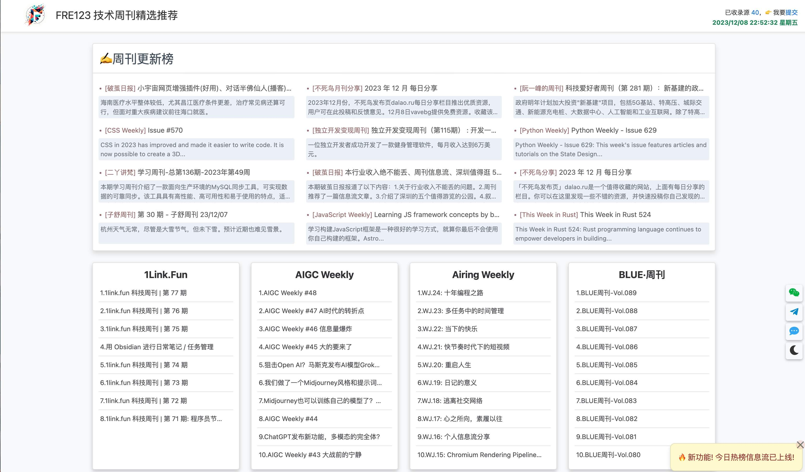

# [Weekly Hub](https://www.fre123.com/wk) - 技术周刊精选列表

汇聚优质精选技术周刊，为你提供高质量信息流，让你的学习更加高效：

- 周刊文章订阅列表：[Weekly Hub](https://www.fre123.com/wk) & 文末有订阅工具推荐👀
- 周刊文章展示地址：[weekly.fre123.com](https://www.fre123.com/weekly)
- 老胡个人的信息周刊：[老胡的信息周刊](https://weekly.howie6879.com/)

## 优质周刊列表

| 🔤   | 名称                                                                                              | 描述                                                                                                                                                                                    |
| --- | ------------------------------------------------------------------------------------------------- | --------------------------------------------------------------------------------------------------------------------------------------------------------------------------------------- |
| 1   | [1Link.Fun](https://1link.fun/)                                                                   | 👀[订阅](https://1link.fun/index.xml) 1Link.Fun 科技周刊，每周更新 10 条有趣的链接                                                                                                       |
| 2   | [AIGC Weekly](https://quail.ink/op7418/)                                                          | 👀[订阅](https://quail.ink/op7418/feed/atom) 每周一更新，主要介绍上周AIGC领域发布的一些产品以及值得关注的研究成果                                                                        |
| 3   | [Airing Weekly](https://weekly.ursb.me/)                                                          | 👀[订阅](https://weekly.ursb.me/index.xml) Airing 的主题思考与推荐分享                                                                                                                   |
| 4   | [BLUE·周刊](https://huazi.zhubai.love/)                                                           | 👀[订阅](https://rsshub.rssforever.com/zhubai/huazi) 在信息爆炸的互联网总能发现许多碎片化信息，本刊记录我每周发现的有趣设计、实用资源、文章资讯等有关设计的一切。                        |
| 5   | [不死鸟月刊分享](https://iui.su)                                                                  | 👀[订阅](https://iui.su/feed/) 分享为王                                                                                                                                                  |
| 6   | [CSS Weekly](http://css-weekly.com/)                                                              | 👀[订阅](http://feeds.feedburner.com/CSS-Weekly) 每周电子邮件汇总最新的CSS文章、教程、工具和实验                                                                                         |
| 7   | [潮流周刊](https://weekly.tw93.fun/)                                                              | 👀[订阅](https://weekly.tw93.fun/rss.xml) 记录 Tw93 潮流前端的日常生活                                                                                                                   |
| 8   | [产品鸭](https://produck.zhubai.love/)                                                            | 👀[订阅](https://rsshub.rssforever.com/zhubai/produck) 每周读一篇新产品与设计思路介绍，创业者产品创业的精神武装。                                                                        |
| 9   | [Decohack](https://www.decohack.com/)                                                             | 👀[订阅](https://rsshub.rssforever.com/zhubai/decohack) 独立开发者灵感周刊，好玩有用的独立产品与开源项目                                                                                 |
| 10  | [独立开发变现周刊](https://www.ezindie.com/weekly)                                                | 👀[订阅](https://www.ezindie.com/feed/rss.xml) 独立开发变现相关的技术、工具、交流等，彼此促进成长，快速落地各自的产品，实现持续盈利                                                      |
| 11  | [DevWeekly](https://github.com/Jackpopc/DevWeekly)                                                | 🙅🏻 每周五发布，精选优质开发者内容，包括开源项目、工具资源、技术文章等方面。                                                                                                              |
| 12  | [二丫讲梵](https://wiki.eryajf.net/learning-weekly/)                                              | 👀[订阅](https://wiki.eryajf.net/learning-weekly.xml) 周刊内容以运维技术和Go语言周边为主，辅以GitHub上优秀项目或他人优秀经验                                                             |
| 13  | [Go语言爱好者周刊](https://studygolang.com/go/weekly)                                             | 👀[订阅](https://rsshub.rssforever.com/studygolang/go/weekly) 记录每周值得分享的 Go 语言相关内容，周日发布                                                                               |
| 14  | [HelloGitHub](https://hellogithub.com/periodical)                                                 | 👀[订阅](https://hellogithub.com/rss) 「HelloGitHub 月刊」分享 GitHub 上有趣、入门级的开源项目，每月 28 号发布最新一期                                                                   |
| 15  | [HTML5 Weekly](http://html5weekly.com/issues/136)                                                 | 👀[订阅](https://cprss.s3.amazonaws.com/frontendfoc.us.xml) 每周一次的前端新闻、文章和教程汇总。涵盖HTML、CSS、WebGL、Canvas、浏览器技术等内容                                           |
| 16  | [iOS Dev Weekly](https://iosdevweekly.com/issues)                                                 | 👀[订阅](https://iosdevweekly.com/issues.rss) Subscribe to a hand-picked round-up of the best iOS development links every week. Curated by Dave Verwer and published every Friday. Free. |
| 17  | [JavaScript Weekly](https://javascriptweekly.com/issues/)                                         | 👀[订阅](https://cprss.s3.amazonaws.com/javascriptweekly.com.xml) JavaScript 文章、新闻和有趣的项目                                                                                      |
| 18  | [机器文摘](https://niupitools.zhubai.love/)                                                       | 👀[订阅](https://rsshub.rssforever.com/zhubai/niupitools) 定期分享我看到的有趣的内容（不一定是最新的，但是有意思），因为大部分都与机器有关，所以先叫它“机器文摘（MachineDigest）”吧。    |
| 19  | [老司机 iOS 周报](https://github.com/SwiftOldDriver/iOS-Weekly)                                   | 👀[订阅](https://github.com/SwiftOldDriver/iOS-Weekly/releases.atom) 对于 iOS 开发者有价值的信息                                                                                         |
| 20  | [老胡的信息周刊](https://weekly.howie6879.com/)                                                   | 👀[订阅](https://weekly.howie6879.com/rss/rss.xml) 记录老胡每周看到的优质资源，包含项目、软件、资料、网站                                                                                |
| 21  | [龙爪槐守望者](https://www.ftium4.com/)                                                           | 👀[订阅](https://www.ftium4.com/rss.xml) 一个帮助交互设计师成长的互联网传说。做任何事情都只是因为兴趣罢了                                                                                |
| 22  | [MDH 前端周刊](https://mdhweekly.com/weekly)                                                      | 👀[订阅](https://mdhweekly.com/rss.xml) 前端技术周刊                                                                                                                                     |
| 23  | [mobilewebweekly](http://mobilewebweekly.co/)                                                     | 👀[订阅](https://mobilewebweekly.co/feed/) 最新的智能手机信息周刊                                                                                                                        |
| 24  | [Node Weekly](https://nodeweekly.com/)                                                            | 👀[订阅](https://cprss.s3.amazonaws.com/nodeweekly.com.xml) 每周提供关于Node.js的新闻和文章                                                                                              |
| 25  | [破茧日报](https://guozh.net/category/daily-information-share/)                                   | 👀[订阅](https://guozh.net/category/daily-information-share/feed/) 破茧日报，老郭种树                                                                                                    |
| 26  | [Python 潮流周刊](https://pythoncat.top/tags/weekly)                                              | 👀[订阅](https://pythoncat.top/rss.xml) Python技术周刊                                                                                                                                   |
| 27  | [Python Weekly](https://us2.campaign-archive.com/home/?u=e2e180baf855ac797ef407fc7&id=9e26887fc5) | 👀[订阅](https://us2.campaign-archive.com/feed?u=e2e180baf855ac797ef407fc7&id=9e26887fc5)  Python Weekly                                                                                 |
| 28  | [前端食堂技术周刊](https://hungryturbo.zhubai.love/)                                              | 👀[订阅](https://rsshub.rssforever.com/zhubai/hungryturbo) 周周尝鲜，人工筛选前端圈每周最新资讯                                                                                          |
| 29  | [前端精读周刊](https://github.com/ascoders/weekly)                                                | 👀[订阅](https://github.com/ascoders/weekly/releases.atom) 前端精读周刊。帮你理解最前沿、实用的技术                                                                                      |
| 30  | [阮一峰的周刊](https://www.ruanyifeng.com/blog/weekly/)                                           | 👀[订阅](https://feeds.feedburner.com/ruanyifeng) 这里记录每周值得分享的科技内容，周五发布                                                                                               |
| 31  | [视野修炼](https://sugarat.top/weekly/)                                                           | 👀[订阅](https://sugarat.top/feed.rss) 每周会精选出一些 优质&有趣 的内容做推送（大前端为主），包含但不限于 优质文章，开源库，工具网站，有意思的知识                                      |
| 32  | [生信爱好者周刊](https://github.com/openbiox/weekly)                                              | 👀[订阅](https://openbiox.github.io/weekly/feed_rss_created.xml) 记录每周值得分享的生信相关内容，周日发布                                                                                |
| 33  | [设计素材周刊](https://moonvy.zhubai.love/)                                                       | 👀[订阅](https://rsshub.rssforever.com/zhubai/moonvy) 来自「Moonvy 月维」分享的最新设计素材与资源                                                                                        |
| 34  | [TechWeekly](https://textdata.cn/tags/techweekly/)                                                | 👀[订阅](https://textdata.cn/tags/techweekly/index.xml) TechWeekly on 大邓和他的PYTHON                                                                                                   |
| 35  | [TO-D 杂志](https://2d2d.io/)                                                                     | 👀[订阅](https://2d2d.io/feed.xml) 专注于探讨全球 To-D 领域相关产品、创业公司、融资等资讯的专栏杂志                                                                                      |
| 36  | [This Week in Rust](https://this-week-in-rust.org/)                                               | 👀[订阅](https://this-week-in-rust.org/atom.xml) Rust技术周刊                                                                                                                            |
| 37  | [偷懒爱好者周刊](https://toolight.zhubai.love/)                                                   | 👀[订阅](https://rsshub.rssforever.com/zhubai/toolight) 分享产品、工具、新鲜事，每周三发布                                                                                               |
| 38  | [Web 技术周刊](https://www.yuque.com/zenany/fe_weekly)                                            | 👀[订阅](https://rsshub.app/yuque/zenany/fe_weekly) 汇总平时看到的好文章，前端技术 & 产品研发为主                                                                                        |
| 39  | [小棉袄的百味人生](https://haikuoshijie.cn/)                                                      | 👀[订阅](https://haikuoshijie.cn/feed/) 小棉袄的博客，嗅觉浏览器、海阔视界开发者的博客                                                                                                   |
| 40  | [优质网站同好者周刊](https://github.com/nicejade/nicelinks-weekly)                                | 🙅🏻 汇聚过去一周倾城所收录的内容，以飨同好                                                                                                                                                |
| 41  | [云原生周刊](https://ask.kubesphere.io/forum/t/Cloud-Native-Weekly)                               | 👀[订阅](https://feed.cnblogs.com/blog/u/535669/rss/) 每周云原生开源项目、文章和资讯推荐                                                                                                 |
| 42  | [子舒周刊](https://zishu.me/categories/%E5%91%A8%E5%88%8A/)                                       | 👀[订阅](https://zishu.me/categories/%E5%91%A8%E5%88%8A/index.xml) 每周四发布，分享有趣的软件，程序，文章等。                                                                            |

## RSS 软件推荐

这么多都是我周刊中体验且推荐过的，应该够用（欢迎提交你觉得好的）：

| 名称                                                                                                                                                                         | 描述                                                                |
| ---------------------------------------------------------------------------------------------------------------------------------------------------------------------------- | ------------------------------------------------------------------- |
| [fluent-reader](https://weekly.howie6879.com/2022/01-23~01-30.%E8%80%81%E8%83%A1%E7%9A%84%E5%91%A8%E5%88%8A%EF%BC%88%E7%AC%AC024%E6%9C%9F%EF%BC%89.html?h=rss#fluent-reader) | 我在用的跨平台rss阅读器                                             |
| [NetNewsWire](https://weekly.howie6879.com/2022/12-12~12-18.%E8%80%81%E8%83%A1%E7%9A%84%E5%91%A8%E5%88%8A%EF%BC%88%E7%AC%AC070%E6%9C%9F%EF%BC%89.html?h=rss#netnewswire)     | 适用于 Mac iPad iPhone 的 RSS 阅读客户端                            |
| [ReadYou](https://weekly.howie6879.com/2022/04-18~04-23.%E8%80%81%E8%83%A1%E7%9A%84%E5%91%A8%E5%88%8A%EF%BC%88%E7%AC%AC036%E6%9C%9F%EF%BC%89.html?h=rss#readyou)             | 一个以 Material You 风格呈现的 Android RSS 阅读器                   |
| [lettura](https://weekly.howie6879.com/2022/10-10~10-16.%E8%80%81%E8%83%A1%E7%9A%84%E5%91%A8%E5%88%8A%EF%BC%88%E7%AC%AC061%E6%9C%9F%EF%BC%89.html?h=rss#lettura)             | 基于 Tauri 跨平台的桌面 RSS 阅读器                                  |
| [feed-flow](https://weekly.howie6879.com/2023/11-06~11-11.%E8%80%81%E8%83%A1%E7%9A%84%E5%91%A8%E5%88%8A%EF%BC%88%E7%AC%AC115%E6%9C%9F%EF%BC%89.html?h=rss#feed-flow)         | FeedFlow 是一款极简主义的 RSS 阅读器，可在 Android、iOS&macOS上使用 |
| [FreshRSS](https://weekly.howie6879.com/2022/08-15~08-21.%E8%80%81%E8%83%A1%E7%9A%84%E5%91%A8%E5%88%8A%20%EF%BC%88%E7%AC%AC053%E6%9C%9F%EF%BC%89.html?h=freshrss#freshrss)   | FreshRSS 是一款自由免费的自部署 RSS 订阅器，界面美观                |
| [ALL-about-RSS](https://weekly.howie6879.com/2021/08-23~08-27.%E8%80%81%E8%83%A1%E7%9A%84%E5%91%A8%E5%88%8A%EF%BC%88%E7%AC%AC002%E6%9C%9F%EF%BC%89.html?h=rss#all-about-rss) | 一份与RSS相关的清单：工具、服务、社区和教程                         |

## 交流

欢迎关注[公众号](https://cdn.jsdelivr.net/gh/howie6879/weekly/src/statics/wechat.jpeg):

如果你有不错的资源希望分享给我，欢迎以**Issue**自荐形式和我沟通。
